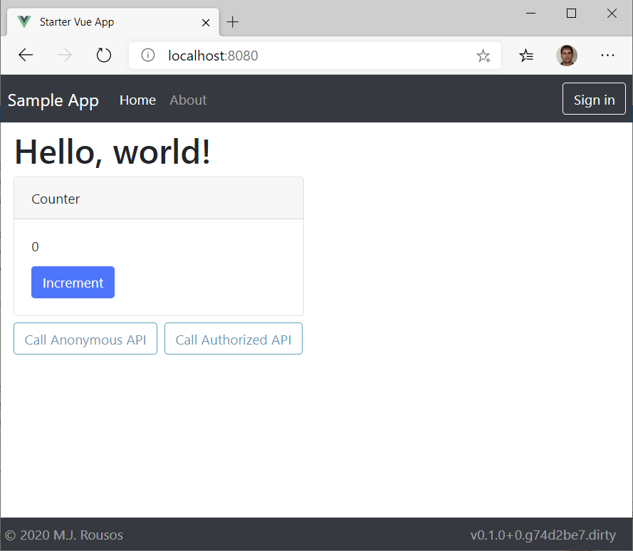

# Vue.js Starter App

## Overview

Sometimes, I want to quickly throw together a simple SPA app to demonstrate some technology or meet some immediate need. These apps won't receive lots of traffic and don't require many fancy features. They may or may not be long-lived. In simple apps like that, the 'boilerplate' work of routing, auth, deployment, etc. can take as long to set up as the interesting bit of the app I intended to make!

To help with that, I intend this repo to be a simple SPA 'starter' app that I can copy as a starting point for future projects that will have all of that standard stuff setup the way I like it so that I can dive right in with building the interesting part of whatever app I'm working on.

## Technologies

* **Vue.js** for the frontend framework
* **Vue-router** for routing
* **Vuex** for state management
* **Axios** for HTTP calls to the backend (or other RESTful services)
* Two backend options:
  * **Dockerized ASP.NET Core** (including **Swagger** and **Swagger UI** endpoints and (soon) a Kubernetes manifest)
  * **Azure Functions** (coming soon)
* **Bootstrap 4** and custom scss styling
* **Toastr** for toasts/snackbar notifications
* **AAD B2C auth** with MSAL for client interactions and a JWT bearer token scheme on the backend
* **Git-describe** for automatic semantic versioning
* **Vue CLI's auto-webpack** for packaging and minification

## App Architecture

### Backend

The backend for this project is very simple. The WebApi project is an ASP.NET Core 3.1 web API that uses JWT bearer auth and serves the SPA app, a health check endpoint, and a couple trivial API endpoints. Response compression is enabled since some of the frontend files are large. I've included a Dockerfile to make containerization easy.

### Frontend

There were two options for building a Vue.js frontend. One option was to make the project as simple as possible by making the frontend a single HTML page that loads dependencies like Vue, Axios, and MSAL from CDNs. The sample project is small enough that that's a reasonable approach.

The other option is to use the Vue CLI and create a richer project structure of multiple Vue components which pulls in dependencies like Axios and MSAL from npm, using the Vue CLI's built-in webpack support to package and minify all the components in a build step. This is a more complicated approach, but will work much better for larger projects.

Since I couldn't decide which way to go, I created both options! In the WebClient folder, you will find:

1. *src/WebClient/public/SingleSource.html* which is a single HTML file encapsulating an entire frontend. The frontend allows the user to login, makes calls to the backend, and supports very simple "routing".
1. *src/WebClient/\** which contains a Vue CLI project producing an end result almost identical to the app served from SingleSource.html. The difference is that the components of the app are all divided into separate .vue source files and services are provided via dedicated classes. The project can be built with the `npm run build` or `npm run serve` commands. As mentioned before, this is a more complex approach to solving the problem, but if you intend to clone this project and add much to it, this is probably the solution that will work better as the frontend size grows.

## Build and Run

To build and run this project:

1. Run `npm install` in *src/WebClient* to restore client-side packages.
1. Run the app. It is possible to serve only the front-end Vue site using the Vue CLI or to run both the backend and frontend together using the .NET CLI.
    1. To run both backend and frontend, navigate to *src/WebApi* and run `dotnet run`.
    1. To serve just the frontend using the Vue CLI, navigate to *src/WebClient* and run `npm run serve`.

The component-based frontend will be available at the app root (http://localhost:5000 or http://localhost:8080, by default) and simple one-HTML-page app is available at the /SingleSource.html path.

Note that with only the two steps above, the site will be served and work, but AAD B2C integration requires a couple extra steps. To make the login/logout experience work, you will need to update a few files with your AAD B2C app information:

1. Update AAD B2C settings for the backend by either updating *src/WebApi/appsettings.json* or by setting equivalent settings via environment variables or user secrets.
1. To enable login/logout in the single source page, add AAD B2C info in the `msalInstance = new Msal.UserAgentApplication` call and in the `getTokenAsync` function, both in *src/WebClient/public/SingleSource.html*.
1. To enable login/logout in the component-based Vue site, update the `authSettings` property in *src/WebClient/src/configuration.js*.

